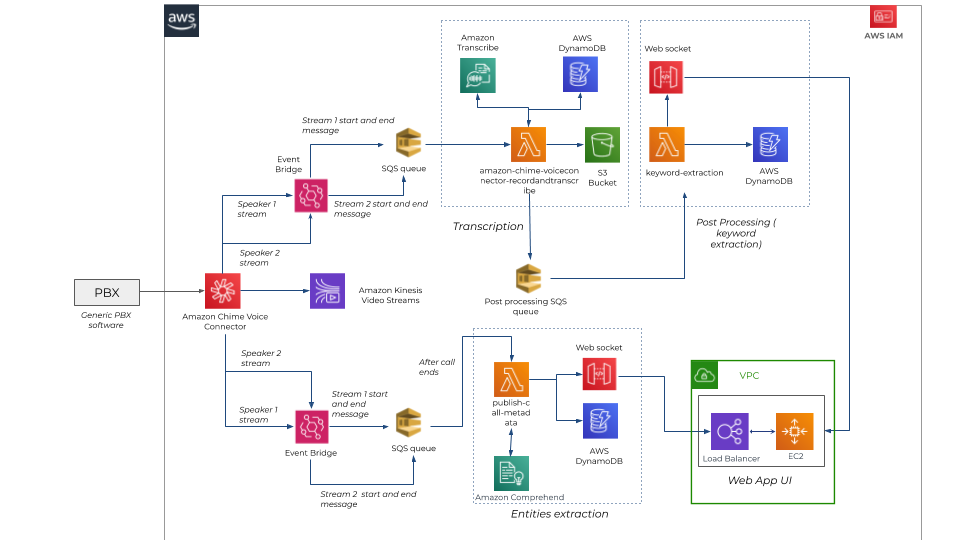

## Real Time Call Analytics Quick Start

This Quick Start reference deployment guide provides step-by-step instructions for deploying Real time call analytics solution on AWS Cloud.

This Quick Start sets up Real-Time transcript generator which can be used by organizations to improve and optimize the remote support by providing users with the ability to create a user interface, where the live call transcripts can be displayed in near real time along with extraction of keywords, metadata and summary of the call.

The [AWS CloudFormation template](https://console.aws.amazon.com/cloudformation/home?region=us-east-1#/stacks/create/template?stackName=realtime&templateURL=https://aws-quickstart.s3.amazonaws.com/quickstart-quantiphi-realtime-analytics/templates/analytics-main.template.yaml) included with the Quick Start automates deploying Real time call analytics solution on AWS. You can also use the AWS CloudFormation template as a starting point for your own implementation.

As shown in the architecture diagram, the Quick Start sets up the above architecture that follows below steps:
* The call stream between customer and the agent / provider will be received from PBX to Amazon Chime Voice Connector in two different streams.

* The chime voice connector streams the audio streams into Kinesis Video Streams.

* The streams of the two speakers trigger the two eventbridge rules simultaneously.

* Each event bridge writes the call metadata and the stream details into the respective SQS queues at the start and the end of the call.

* These messages using SQS queue (ChimeVoiceConnectorStreaming1), triggers the Transcription lambda (LiveCallsTranscriberFunction) function. This lambda function reads the audio streams from Kinesis and makes a call to Amazon Transcribe.

* The Transcription Lambda also writes the transcript data into the DynamoDB table (LiveCallsTranscriptionTable) and publishes a message to post processing SQS Queue (TranscribeResultsStreaming). This lambda also stores the mp3 file after call completion to the s3 bucket.

* Post processing SQS triggers the post processing Lambda (KeywordExtractionFunction) function. Here the transcripts are cleaned and key words are extracted using string matching. The results are stored into a DynamoDB table (KeywordExtractionTable).

* Post processing Lambda also publishes the transcripts and the keyword data to the Customer User Interface via the websocket.

* When the call ends, we receive a SQS message for both the streams through the eventbridge rule. A metadata Lambda (PublishCallMetadataFunction) function will be triggered by this SQS queue (ChimeVoiceConnectorStreaming2). In this Lambda we extract the entities from the transcripts using custom entity extraction logic and Amazon Comprehend. This lambda notifies the frontend that the call has ended and publishes the entity metadata to the websocket and stores the data into the DynamoDB table (LiveCallsMetadataTable).

NOTE: You are responsible for the cost of the AWS services used while running this Quick Start. There is no additional cost for using the Quick Start.

To post feedback, submit feature ideas, or report bugs, use the **Issues** section of this GitHub repo. 
To submit code for this Quick Start, see the [AWS Quick Start Contributor's Kit](https://aws-quickstart.github.io/).

## Notices
This document is provided for informational purposes only. It represents AWS’s current product offerings and practices as of the date of issue of this document, which are subject to change without notice. Customers are responsible for making their own independent assessment of the information in this document and any use of AWS’s products or services, each of which is provided “as is” without warranty of any kind, whether expressed or implied. This document does not create any warranties, representations, contractual commitments, conditions, or assurances from AWS, its affiliates, suppliers, or licensors. The responsibilities and liabilities of AWS to its customers are controlled by AWS agreements, and this document is not part of, nor does it modify, any agreement between AWS and its customers.

The software included with this paper is licensed under the Apache License, version 2.0 (the "License"). You may not use this file except in compliance with the License. A copy of the License is located at http://aws.amazon.com/apache2.0/ or in the accompanying "license" file. This code is distributed on an "AS IS" BASIS, WITHOUT WARRANTIES OR CONDITIONS OF ANY KIND, either expressed or implied. See the License for specific language governing permissions and limitations.