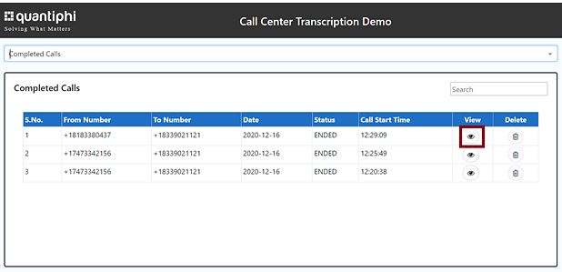
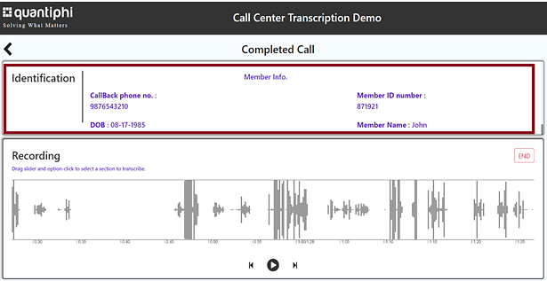
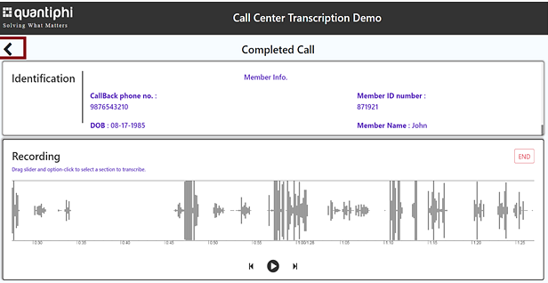

== Test the deployment

To test this Quick Start after deployment, the following items are required:

* PBX software integrated with Amazon Chime Voice Connector.
* An active call in the Quantiphi call transcription application.

=== View active call transcription

To view a near-real-time transcription of an active call, do the following:

:xrefstyle: short

[start=1]
. Navigate to the web application URL. After stack deployment is complete, the web application URL is displayed on the *Outputs* tab. It is the value displayed for the `LoadBalancerDNSAddr` key, as shown in <<output>>.

[#output]
.Web application URL on the Outputs tab
[link=images/Output.png]

[start=2]
. On the Quantiphi dashboard, select *Active Calls* from the drop down list.
. A table of active calls displays. Choose the icon in the *View* column of an active call.

[#UI-2]
.Active calls table on the Quantiphi dashboard
[link=images/SS2.png]
image::../images/SS2.png[UI for {partner-product-name},width=648,height=439]

NOTE: The message “No Active Calls Found” displays if there are no active calls. An active call is required to test the deployment using these instructions.

[start=4]
. The live call transcription displays in the *Transcription* section of the dashboard. Keywords extracted from the call display in the *Call Capture* section, as shown in <<UI-3>>.

[#UI-3]
.Transcription and keyword displays on the Quantiphi dashboard
[link=images/SS3.png]
image::../images/SS3.png[UI for {partner-product-name},width=648,height=439]

[start=5]
. Once the call is ended, caller identification details display in the *Identification* section of the dashboard, as shown in <<UI-4>>.

[#UI-4]
.Identification details on the Quantiphi dashboard
[link=images/SS4.png]
image::../images/SS4.png[UI for {partner-product-name},width=648,height=439]

=== View and download call transcription and keywords

[start=1]
. To view and download a transcription after a call, choose the download icon in the *Transcription* section.

[#UI-5]
.Download call transcription
[link=images/SS5.png]
image::../images/SS5.png[UI for {partner-product-name},width=648,height=439]

[start=2]

. The transcription displays in the *Transcription Details* window. Choose *Download CSV* to download the transcription in a CSV file. 

[#UI-6]
.Download CSV
[link=images/SS6.png]
image::../images/SS6.png[UI for {partner-product-name},width=648,height=439]

[start=3]
. Choose the table icon in the *Call Capture* section to view and download keywords.

[#UI-6a]
.Download keywords
[link=images/SS6a.png]

=== Transcription replays

To replay a completed call, do the following:

[start=1]

. On the Quantiphi dashboard, select *Completed Calls* from the drop down list.

[#UI-7]
.Quantiphi dashboard 
[link=images/SS7.png]
image::../images/SS7.png[UI for {partner-product-name},width=648,height=439]

[start=2]
. A table of completed calls displays. Choose the icon in the *View* column of a completed call, as shown in <<UI-9>>. 

[#UI-9]
.Completed calls on the Quantiphi dashboard 
[link=images/SS9.png]

[start=3]
. To play the call, choose the play icon in the *Recording* section or *Begin* in the *Transcription* section. 

[#UI-10]
.Starting a playback
[link=images/SS10.png]
image::../images/SS10.png[UI for {partner-product-name},width=648,height=439]

[start=4]
. The transcription and keywords of the playback display in the *Transcription* and *Call Capture* sections, respectively.

[#UI-12]
.Playback transcription and keywords
[link=images/SS12.png]
image::../images/SS12.png[UI for {partner-product-name},width=648,height=439]

[start=5]
. You can move the playback head to play a different section of the call. Or, use the forward and backward controls to jump.

[#UI-13]
.Playback head and forward and backward controls
[link=images/SS13.png]
image::../images/SS13.png[UI for {partner-product-name},width=648,height=439]

[start=6]
. You can click a keyword in the *Call Capture* section to play the sentence in the call containing the keyword.

[#UI-14]
.Completed calls transcription dashboard (Call capture component keyword buttons)
[link=images/SS14.png]
image::../images/SS14.png[UI for {partner-product-name},width=648,height=439]

[start=7]

. Click *Cancel* in the *Transcription* section to stop the transcription. The playback head will return to the beginning of the call. 

[#UI-15]
.Completed calls transcription dashboard (Cancel button)
[link=images/SS15.png]
image::../images/SS15.png[UI for {partner-product-name},width=648,height=439]

You can view and download the entire call transcription and keywords. See link:#_view
[#UI-16]
.Completed calls transcription dashboard (Download button)
[link=images/SS16.png]
image::../images/SS16.png[UI for {partner-product-name},width=648,height=439]

[start=9]
. Once the call is reached to its end time, the user will be able to view the complete transcription and its respective keywords by clicking the “Download” and “Table” icon in the “Transcription” and “Call Capture” component respectively.

[#UI-17]
.Completed calls transcription dashboard (Download transcription component)
[link=images/SS17.png]

[start=10]
. The user will be able to download the transcription and keywords in CSV format by clicking the “Download CSV” button

[#UI-18]
.Completed calls transcription dashboard (Redo button)
[link=images/SS18.png]
image::../images/SS18.png[UI for {partner-product-name},width=648,height=439]

[start=11]
. The user has the functionality to restart the transcription by clicking the “Redo” button either in the “Transcription” component or in the “Call Capture” component.

[#UI-19]
.Completed calls transcription dashboard (Call Metadata Identification component)
[link=images/SS19.png]

[start=12]
. Once the file is loaded and all the required information is fetched at the end of transcription, the user will be able to view an “Identification” component at the top which has “Members Info” segregated.

[#UI-20]
.Completed calls transcription dashboard (Back button)
[link=images/SS20.png]

[start=13]
. To move back to the previous module click on the left arrow button placed at the top beside the module header.

