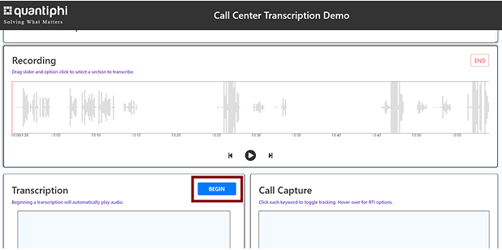
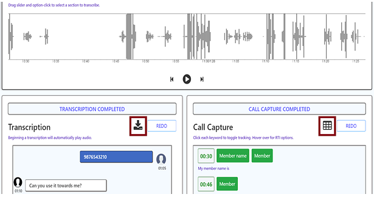

== Test the deployment

[#Output] 
.Quick Start Main Stack Output for {partner-product-name}
[link=images/Output.png]
image::../images/Output.png[UI for {partner-product-name},width=648,height=439]

In the outputs of the main stack check for the *LoadBalancerDNSAddr* key, to get the _url_
of the web app.

The {partner-product-name} has two functionalities:

. Active call live transcription 
. Completed call transcription replay

Following are the steps to interact with UI to check the above mentioned functionalities.

=== ACTIVE CALLS

Steps to capture active calls transcriptions:

[#UI-1] 
.UI landing page
[link=images/SS1.png]
image::../images/SS1.png[UI for {partner-product-name},width=648,height=439]

[start=1]
. From the drop-down make sure the “Active Calls” option is selected. Once selected the user will be able to see a table that will showcase all the calls which are active. If the user finds a message “No Active Calls Found” that means there are no active calls.

[#UI-2]
.Active calls page showing ongoing calls
[link=images/SS2.png]

[start=2]
. In the table, the user needs to click on the view (eye icon) button. This will redirect the user to the transcription component of the application where the user will be able to see all the real-time transcription.

[#UI-3]
.Active calls transcription dashboard (Transcription and Call Capture components)
[link=images/SS3.png]
image::../images/SS3.png[UI for {partner-product-name},width=648,height=439]

[start=3]
. In the real-time transcription phase where the call is still in the active state, the user will be able to see the transcription on the “Transcription” component and the respective keywords on the “Call Capture” component.

[#UI-4]
.Active calls transcription dashboard (Call Metadata Identification component)
[link=images/SS4.png]

[start=4]
. Once the call is ended, the user will be able to see all the entity identification details in the “Identification” component which is at the top in the module as shown in <<UI-4>>.

[#UI-5]
.Active calls transcription dashboard (Download transcription component)
[link=images/SS5.png]
image::../images/SS5.png[UI for {partner-product-name},width=648,height=439]

[#UI-6]
.Active calls transcription dashboard (Download transcription component)
[link=images/SS6.png]

[start=5]
. The user will have the capability to view and download the complete transcriptions and keywords details in the CSV format. Once the call is ended, the user will be able to see a download icon and a table icon in the “Transcription” and “Call Capture” component respectively. On clicking the icons the user will be able to see the details in tabular form and will be able to download the details by clicking on “Download CSV”.

=== COMPLETED CALLS

The following are the steps to capture completed calls transcriptions.

[#UI-7]
.Page Selector 
[link=images/SS7.png]

[start=1]
. From the drop-down on the top of the module select the “Completed Calls” option. 

[#UI-8]
.Completed calls page showing all completed calls 
[link=images/SS8.png]

[start=2]
. On selecting the “Completed Calls” option the user will be able to see a table with the details of all the completed calls.

[#UI-9]
.Completed calls page (View button) 
[link=images/SS9.png]
image::../images/SS9.png[UI for {partner-product-name},width=648,height=439]

[start=3]
. In the table, the user needs to click on the view button (eye icon) of a particular row. This will redirect the user to the transcription component of the application where the user will be able to see all the transcription of the completed calls.

[#UI-10]
.Completed calls transcription dashboard (Play button)
[link=images/SS10.png]

[start=4]
. Below the “Identification” component, the user will be able to hear the recorded call with the help of the “Recording” component. To start the recording, the user will have two options to start

[start=1]
.. By clicking the “Play” button in the “Recording” component.

[#UI-11]
.Completed calls transcription dashboard (Begin button)
[link=images/SS11.png]

[start=2]
.. By clicking the “Begin” button in the “Transcription” component.

[#UI-12]
.Completed calls transcription dashboard (Transcription and Call Capture components)
[link=images/SS12.png]
image::../images/SS12.png[UI for {partner-product-name},width=648,height=439]

[start=5]
. While the transcription is in progress the user will be able to view the transcription and its respective keywords in the “Transcription” and “Call Capture” component respectively in a synchronization of the time interval of the audio.

[#UI-13]
.Completed calls transcription dashboard (Audio playback controls)
[link=images/SS13.png]
image::../images/SS13.png[UI for {partner-product-name},width=648,height=439]

[start=6]
. The user will have the functionality to move forward or backward in the recorded audio by clicking the “Forward” and “Backward” icon in the “Recording” component and also by moving the “Red” cursor in the waves of the audio.

[#UI-14]
.Completed calls transcription dashboard (Call capture component keyword buttons)
[link=images/SS14.png]
image::../images/SS14.png[UI for {partner-product-name},width=648,height=439]

[start=7]
. The user has the functionality to hear the sentence where the keyword is captured by clicking on the keyword button in the “Call Capture” component. This will play the audio of the sentence where the keyword was captured and the transcription and audio controls will restart from that point.

[#UI-15]
.Completed calls transcription dashboard (Cancel button)
[link=images/SS15.png]
image::../images/SS15.png[UI for {partner-product-name},width=648,height=439]

[start=8]
. The user has the functionality to cancel the transcription by clicking the “Cancel” button in the “Transcription” component. This will restart the audio and will move its control to the start time.

[#UI-16]
.Completed calls transcription dashboard (Download button)
[link=images/SS16.png]

[start=9]
. Once the call is reached to its end time, the user will be able to view the complete transcription and its respective keywords by clicking the “Download” and “Table” icon in the “Transcription” and “Call Capture” component respectively.

[#UI-17]
.Completed calls transcription dashboard (Download transcription component)
[link=images/SS17.png]
image::../images/SS17.png[UI for {partner-product-name},width=648,height=439]

[start=10]
. The user will be able to download the transcription and keywords in CSV format by clicking the “Download CSV” button

[#UI-18]
.Completed calls transcription dashboard (Redo button)
[link=images/SS18.png]

[start=11]
. The user has the functionality to restart the transcription by clicking the “Redo” button either in the “Transcription” component or in the “Call Capture” component.

[#UI-19]
.Completed calls transcription dashboard (Call Metadata Identification component)
[link=images/SS19.png]
image::../images/SS19.png[UI for {partner-product-name},width=648,height=439]

[start=12]
. Once the file is loaded and all the required information is fetched at the end of transcription, the user will be able to view an “Identification” component at the top which has “Members Info” segregated.

[#UI-20]
.Completed calls transcription dashboard (Back button)
[link=images/SS20.png]
image::../images/SS20.png[UI for {partner-product-name},width=648,height=439]

[start=13]
. To move back to the previous module click on the left arrow button placed at the top beside the module header.

