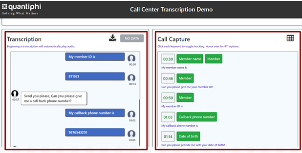
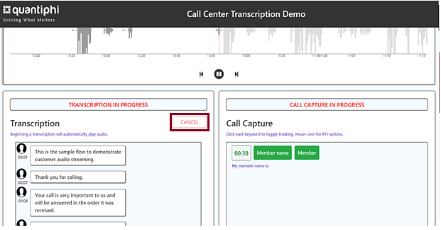

== Test the deployment

To test this Quick Start after deployment, the following items are required:

* PBX software integrated with Amazon Chime Voice Connector.
* An active call in the Quantiphi call transcription application.

=== View active call transcription

To view a live transcription of an active call, do the following:

:xrefstyle: short

[start=1]
. In the AWS CloudFormation console, choose the *Outputs* tab. Retrieve the URL in the *Value* column of the `LoadBalancerDNSAddr` key, as shown in <<output>>.

[#output]
.Web application URL on the Outputs tab
[link=images/Output.png]
image::../images/Output.png[UI for {partner-product-name},width=648,height=439]

[start=2]
. Navigate to the URL from step 1.
. On the Quantiphi dashboard, select *Active Calls* from the drop down list.
. A table of active calls displays. Choose the icon in the *View* column of an active call.

[#UI-2]
.Active calls table
[link=images/SS2.png]
image::../images/SS2.png[UI for {partner-product-name},width=648,height=439]

NOTE: The message “No Active Calls Found” displays if there are no active calls. An active call is required to test the deployment using these instructions.

[start=4]
. The live call transcription displays in the *Transcription* section of the dashboard. Keywords extracted from the call display in the *Call Capture* section, as shown in <<UI-3>>.

[#UI-3]
.Transcription and keyword displays
[link=images/SS3.png]

[start=5]
. Once the call is ended, caller identification details display in the *Identification* section of the dashboard, as shown in <<UI-4>>.

[#UI-4]
.Caller identification
[link=images/SS4.png]
image::../images/SS4.png[UI for {partner-product-name},width=648,height=439]

=== View and download call transcription and keywords

[start=1]
. To view and download a transcription after a call, choose the download icon in the *Transcription* section.

[#UI-5]
.Download call transcription
[link=images/SS5.png]
image::../images/SS5.png[UI for {partner-product-name},width=648,height=439]

[start=2]

. The transcription displays in the *Transcription Details* window. Choose *Download CSV* to download the transcription in a CSV file. 

[#UI-6]
.Download CSV
[link=images/SS6.png]
image::../images/SS6.png[UI for {partner-product-name},width=648,height=439]

[start=3]
. Choose the table icon in the *Call Capture* section to view and download keywords.

[#UI-6a]
.Download keywords
[link=images/SS6a.png]
image::../images/SS6a.png[UI for {partner-product-name},width=648,height=439]

=== Transcription replays

To replay a completed call, do the following:

[start=1]

. On the Quantiphi dashboard, select *Completed Calls* from the drop down list.

[#UI-7]
.Quantiphi dashboard 
[link=images/SS7.png]
image::../images/SS7.png[UI for {partner-product-name},width=648,height=439]

[start=2]
. A table of completed calls displays. Choose the icon in the *View* column of a completed call, as shown in <<UI-9>>. 

[#UI-9]
.Completed calls on the Quantiphi dashboard 
[link=images/SS9.png]
image::../images/SS9.png[UI for {partner-product-name},width=648,height=439]

[start=3]
. To play the call, choose the play icon in the *Recording* section or *Begin* in the *Transcription* section. 

[#UI-10]
.Starting a playback
[link=images/SS10.png]
image::../images/SS10.png[UI for {partner-product-name},width=648,height=439]

[start=4]
. The transcription and keywords of the playback display in the *Transcription* and *Call Capture* sections, respectively.

[#UI-12]
.Playback transcription and keywords
[link=images/SS12.png]
image::../images/SS12.png[UI for {partner-product-name},width=648,height=439]

[start=5]
. You can move the playback head to play a different section of the call. Or, use the forward and backward controls to jump.

[#UI-13]
.Playback head and forward and backward controls
[link=images/SS13.png]
image::../images/SS13.png[UI for {partner-product-name},width=648,height=439]

[start=6]
. You can choose a keyword in the *Call Capture* section to jump to the section of the audio containing the keyword.

[#UI-14]
.Jump to a sections of call audio by choosing keywords
[link=images/SS14.png]

TIP: To view and download the entire call transcription and keywords, see link:#_view_and_download_call_transcription_and_keywords[View and download call transcription and keywords].

[start=7]
. Click *Cancel* in the *Transcription* section to stop the transcription. The playback head will return to the beginning of the call. 

[#UI-15]
.Cancel playback and transcription
[link=images/SS15.png]

[start=8]
. Click *Redo* in the *Transcription* or *Call Capture* sections to restart the playback and transcription from the beginning of the call.

[#UI-18]
.Redo playback and transcription from the beginning
[link=images/SS18.png]
image::../images/SS18.png[UI for {partner-product-name},width=648,height=439]

[start=9]
. At the end of the transcription, the caller identification details display in the *Identification* section of the dashboard, as shown in <<UI-19>>.

[#UI-19]
.Caller identification
[link=images/SS19.png]
image::../images/SS19.png[UI for {partner-product-name},width=648,height=439]

[start=10]
. To go back, choose the left arrow button.

[#UI-20]
.Back
[link=images/SS20.png]
image::../images/SS20.png[UI for {partner-product-name},width=648,height=439]