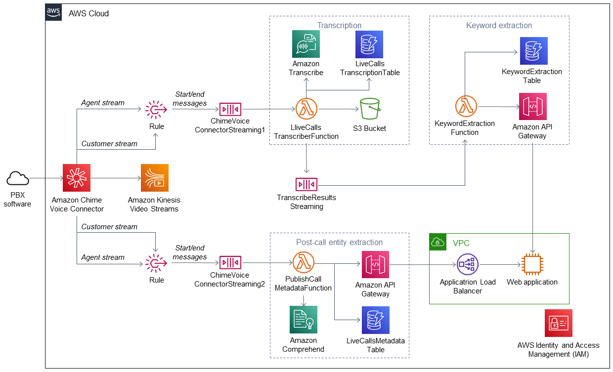

Deploying this Quick Start with default parameters builds the following {partner-product-name} environment in the AWS Cloud.

// Replace this example diagram with your own. Send us your source PowerPoint file. Be sure to follow our guidelines here : http://(we should include these points on our contributors guide)
:xrefstyle: short
[#architecture1]
.Quick Start architecture for {partner-product-name} on AWS
[link=images/quantiphi-real-time-analytics-architecture-diagram.png]

As shown in the <<architecture1>>, the Quick Start sets up the following:

[start=1]
* Amazon Chime Voice Connector to receive calls from user Private Branch Exchange (PBX) software.
* Kinesis Video Streams to store call streams.
* Amazon EventBridge to write messages to Amazon Simple Queue Service (Amazon SQS) queues when call begins and ends.
* Amazon SQS queues to store messages that are read by AWS Lambda functions.
* AWS Lambda functions to poll SQS queues and initiate transcription, keyword-extraction, and post-call metadata extraction routines.
* Amazon Transcribe to transcribe audio streams.
* Amazon DynamoDB tables to store transcriptions, keywords, and call metadata.
* Amazon S3 bucket to store MP3 files of calls.
* Amazon API Gateway to manage access to the Quantiphi web application.
* In the virtual private cloud (VPC):
** An Application Load Balancer to balance traffic between Quantiphi web application nodes.
** 1–4 Amazon Elastic Compute Cloud (Amazon EC2) instances to host Quantiphi web application nodes. The number of hosts is chosen during deployment.
* AWS Identity and Access Management (IAM) to manage IAM roles and policies.

//[.small]#*The template that deploys the Quick Start into an existing VPC skips the components marked by asterisks and prompts you for your existing VPC configuration.#