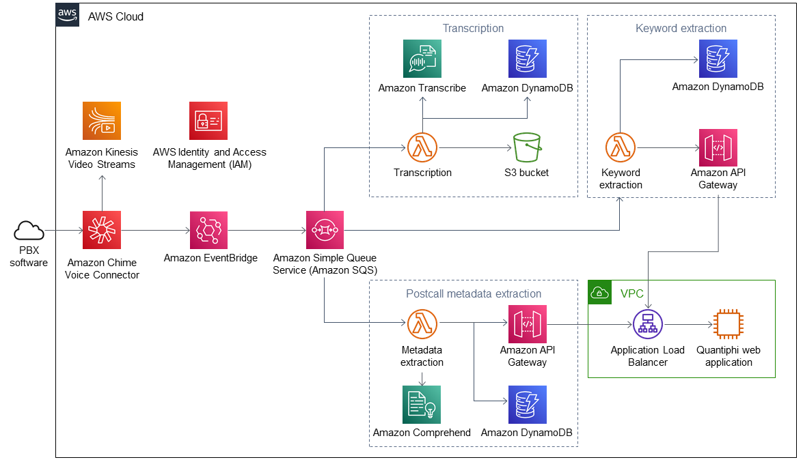

Deploying this Quick Start with default parameters builds the following {partner-product-name} environment in the AWS Cloud.

// Replace this example diagram with your own. Send us your source PowerPoint file. Be sure to follow our guidelines here : http://(we should include these points on our contributors guide)
:xrefstyle: short
[#architecture1]
.Quick Start architecture for {partner-product-name} on AWS
//[link=images/quantiphi-real-time-analytics-architecture-diagram.png]

As shown in the <<architecture1>>, the Quick Start sets up the following:

[start=1]
* Amazon Chime Voice Connector to receive calls from user private branch exchange (PBX) software.
* Kinesis Video Streams to store call streams.
* Amazon EventBridge to write messages to Amazon Simple Queue Service (Amazon SQS) queues when call begins and ends.
* Amazon SQS queues to store messages that are read by AWS Lambda functions.
* In the transcription queue:
** AWS Lambda function to read audio streams from Kinesis Video Streams and initiate transcription.
** Amazon Transcribe to transcribe call streams.
** Amazon DynamoDB table to store transcriptions.
** Amazon Simple Storage Service (Amazon S3) bucket to store MP3 files of call streams.
* In the keyword-extraction queue:
** AWS Lambda function to extract keywords and publish them to the Quantiphi web application.
** DynamoDB table to store keywords.
** API Gateway to manage access to the Quantiphi web application.
* In the postcall metadata-extraction queue:
** AWS Lambda function to extract metadata and publish it to the Quantiphi web application.
** Amazon Comprehend to extract metadata.
** DynamoDB table to store metadata.
** API Gateway to manage access to the Quantiphi web application.
* In the virtual private cloud (VPC):*
** An Application Load Balancer to route traffic between Quantiphi web application nodes.*
** 1-4 Amazon Elastic Compute Cloud (Amazon EC2) instances to host Quantiphi web application nodes. You choose the number of hosts during deployment.
* AWS Identity and Access Management (IAM) to manage IAM roles and policies.

[.small]#*The template that deploys the Quick Start into an existing VPC skips the components marked by asterisks and prompts you for your existing VPC configuration.#